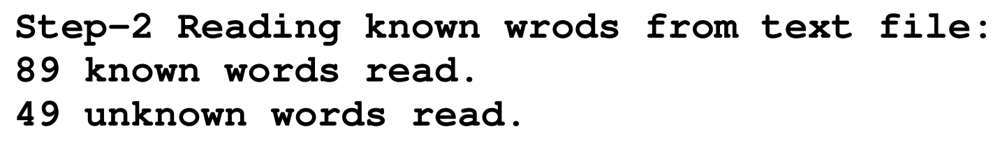
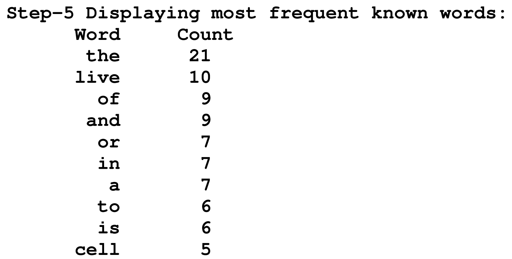

# Assignment 3

**Due**:  11.59pm Week 10, Friday 11 May

**Week-9**: Step-1&2 demo 2marks. 

**Week-10:** submission 8 marks.

## Aim

This assignment is to familiarise you with the use of STL container classes in your programs. 
On completion you should know how to:

* Write C++ code using STL container class objects. 
* Devise programs requiring data manipulation with STL containers. 
* Gain experience writing and debugging complex C++ programs incrementally. 

## Prerequisite

Before you undertake this assignment please review the week 8 lecture notes on the Standard 
Template Library (STL). Also, download and study the week 7 & 8 STL example programs in the 
Examples folder. The following links may also prove useful for learning STL containers: 

* [http://www.cplusplus.com/reference/stl/](http://www.cplusplus.com/reference/stl/)
* [http://www.cprogramming.com/tutorial/stl/stlintro.html](http://www.cprogramming.com/tutorial/stl/stlintro.html)
* [http://www.sgi.com/tech/stl/stl_introduction.html](http://www.sgi.com/tech/stl/stl_introduction.html)

If you are unsure on how to do something with STL, try looking at the examples or google “STL” 
together with “set” or “map” or “multi-map” etc. 

## Requirements:

For this assignment you are to implement a C++ program that can read a text file and display any known words on the screen together with their frequency and position in the file. Below shows a snippet of what the output should look like: 


A “known” word is a word that is in the English dictionary which is defined by the words listed in the file named “dictionary.txt”. The word “Positions” are determined by all the places where each word occurs in the data file. For example, in the above screen output, the word “first” occurred twice, at the 20th and 110th word position in the test data file. 

A partially completed “WordStat” class is provided in “wordstat.h” and “wordstat.cpp”. A driver program is also provided in main.cpp. The file: “output.txt” shows the output your completed program should produce when run with redirected input from “input.txt”. You should do this assignment incrementally by completing the following steps.

### Step 1 (2 marks)

Implement the `ReadDictionary()` and `DisplayDictionary()` public member function in the “wordstats” class in “wordstat.h & “wordstat.cpp”. ReadDictionary should open “dictionary.txt” and read all the words (in lower case format) into the private “Dictionary” member: 

```c++
set<string> Dictionary;
```

If you are unsure on using the STL set container, take a look at “08-set.cpp” in the examples folder. `DisplayDictionary()` should display the first 20 words in the Dictionary on the screen. The 
screenshot below shows an example output of reading and displaying the dictionary. 


### Step 2 (2 marks)

Implement the `ReadTextFile()` public member function. This function should read the contents of 
the file named: “testdata.txt” into the “KnownWords” and “UnknownWords” data members of the 
“WordStats” class: 

```c++
WordMap KnownWords; 
WordMap UnknownWords; 
```

Please note that “WordMap” is typedefed in “wordstat.h” as:

```c++
typedef map<string, vector<int> > WordMap;
```


Only “known” words should be put in the “KnownWords” WordMap. A “known” word is any 
word that is found in the Dictionary class member. Before attempting to find a word in the 
Dictionary, you should first preprocess the word by converting all characters to lower case and 
remove any non-alphabetic characters except for the punctuation marks: hyphen (-) and apostrophe 
(‘). You can add additional private member functions to class WordStats if you wish. Your output 
from step-2 should look something like this:



If you are unsure on working with map containers, an example is provided in “08-map.cpp” in the 
example folder. 

### Step 3 (1 mark)

Implement the `DisplayKnownWordStats();` public member function. This function should iterate the “KnownWords” WordMap and display the word stats on the screen as shown on page 1. If you are unsure on how to do this with a map look at “08-map.cpp” in the example folder.

### Step 4 (1 mark)

Implement the `DisplayUnknownWordStats()` public member function. This function should 
display the unknown words in the same format as step-3. Note: try to avoid duplicating code for 
this by declaring an additional private member function that is passed a WordMap by reference 
and called by both the display functions from step-3 and step-4.

### Step 5 (1 mark)

Implement the `DisplayMostFreqKnownWords()` public member function. This function should display the 10 most frequently occurring words in the “KnownWords” container. E.g.



To do this declare a local `multimap<int, string>;` container. You will need to iterate the 
“KnownWords” container and insert the size of the vector (as the key) and the word into the local 
multimap. This multimap can then be iterated to display the 10 most frequent words on the screen.

### Step 6 (1 mark)

Implement the `DisplayMostFreqUnknownWords()` public member function to display the 10 most frequently occurring words in the “UnknownWords” container. Again, try to avoid duplicate code by adding another private member function called by the display functions from setp-5 and 6.

### Step 7 (1 mark)

Implement the `DisplayOriginalText()` public member function. To do this declare a local 
`map<int,string>;` container and do the same as you did with Step 6, except you should also iterate 
the vectors in the KnownWords and UnknownWords containers and add the <position, word> pair 
for all words and their positions. This will sort the words into their original text order based on the 
word position numbers. The screen output should look something like below. 

```
the game of life written by ian sharpe the game of life was invented by the mathematician john conway and first reached a wide public when it was written up in scientific american in 1970 or thereabouts in those days it was mostly played on squared paper nowadays computers take all the hard work out of this fascinating invention to some it's nothing more than a toy to others it and related cellular automata are subjects for serious study in this implementation the screen is divided into a grid of cells 40 wide by 24 deep a cell may be live (red or dead (white) you begin by creating the first generation of live cells or seed . . . 
```

## Submit

Submit your files and the output produced when run (copy & paste screen) using the submit facility on UNIX as shown below: 

```bash
$ submit -u login -c CSCI251 –a3 main.cpp wordstats.h wordstats.cpp output.txt
```

where 'login' is your UNIX login ID.

*To receive 2 marks for your demo, you should demonstrate step-1 and explain (or show) step-2 of your program in your week 9 lab class. Failure to do the demo on time without granted extension will result in a 1 mark deduction for each week late.*

Deductions will be made for untidy work or for failing to comply with the submission instructions. Requests for alternative submission arrangements will only be considered before the due date. An extension of time for the assignment submission may be granted in certain circumstances. Any request for an extension of the submission deadline must be made to the Subject Coordinator before the submission deadline. Supporting documentation must accompany the request for any extension. Late assignment submissions without granted extension will be marked but the marks awarded will be reduced by 1 mark for each day late. Assignments will not be accepted if more than four days late.

